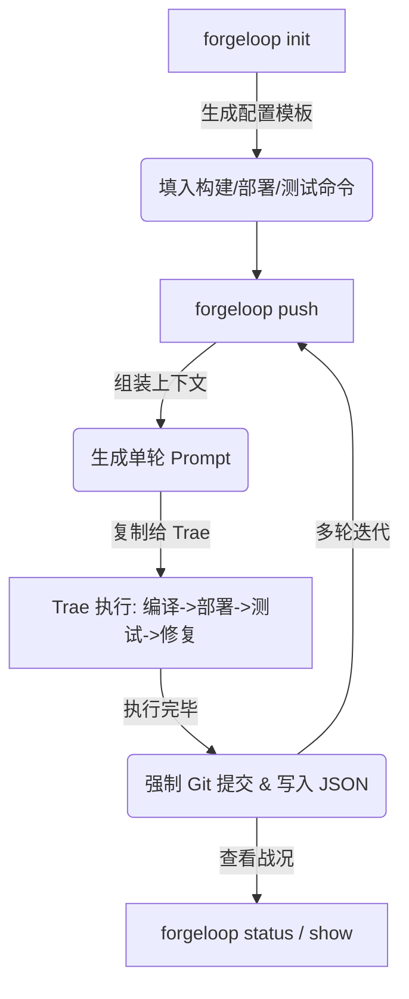

近年来，以 Trae 的 Solo Coder 为代表的 IDE Agent 能力越来越强。但在面对 Apache Doris 这样重型的 C++ / Java / Rust 大型开源数据库工程时，AI 往往会暴露出一些致命缺陷：

1. 🤯 **记不住复杂的构建/部署环境**：几十行的 `cmake`、`maven` 或 `docker compose` 指令，AI 经常在多轮对话后遗忘。
2. 🔄 **陷入死循环**：遇到深层的编译报错时，AI 容易疯狂盲目重试，直到耗尽上下文窗口。
3. 🗑️ **开发状态混乱**：挂机跑了一晚上，完全不知道它解决了什么、提交了什么代码、消耗了多少 Token。

为了解决这些问题，我开发了 **ForgeLoopAI** —— 一个专为 IDE Agent 设计的**极简开发上下文与 Prompt 管理器**。

🔗 **项目开源地址**：[https://github.com/FayneBupt/ForgeLoopAI](https://github.com/FayneBupt/ForgeLoopAI)

## 1. 为什么放弃传统的 CI/CD？

在自动化 AI 开发流时，很多人第一反应是搞一套 Jenkins 或 GitHub Actions。但对于单机上的 IDE Agent 来说，这种 Pipeline 架构太重了。

**ForgeLoopAI 彻底摒弃了沉重的架构。** 它通过「本地文件记录」和「单轮强约束 Prompt 生成」的机制，将复杂的开发流程降维成 **1 个配置文件** 和 **3 个极简命令**。它不仅不需要数据库，也不需要常驻 Daemon 服务。

## 2. ForgeLoopAI 的核心工作流

ForgeLoopAI 的核心定位是极简的“上下文管理器”。它的工作流非常直接：



### 2.1 组合命令管理与状态隔离

一切状态均记录在当前目录的 `runtime/` 中。通过 `config.json`，我们将 `build` / `deploy` / `test` 的多行 Bash 命令统一托管，每次发给 AI 前自动注入。

### 2.2 单轮防失控机制（核心契约）

这是控制 AI 的关键。在生成的 Prompt 中，ForgeLoopAI 会**强行约束 AI 执行「编译->部署->测试->修复」的单轮闭环后必须立即停止工作**。

- **首轮**：分析目标，修改代码并执行验证。
- **多轮续接**：自动抓取上一轮的报错点（状态、Bug、Fix），让 AI 从失败处无缝接手。

### 2.3 强制输出契约与战况汇总

AI 工作完成后，必须按要求将成果写入本地的 `round_N.json` 文件中，包括：
- 遇到的 Bug 和修复方案
- 强制生成的 Git Commit Hash
- Token 消耗明细

你在终端只需敲一行 `forgeloop status`，就能看到漂亮的动态自适应战况表格，项目进度一览无余。

## 3. 最佳实践：搭配极简湖仓沙盒

在进行 Apache Doris 等湖仓一体（Lakehouse）组件的外部数据源集成开发时，我们往往需要一个底层的存储和元数据环境。

这里强烈推荐搭配我之前开源的 [Lakehouse-Sandbox-Cluster](https://github.com/FayneBupt/Lakehouse-Sandbox-Cluster)。它是一个极简的 Docker Compose 编排项目，包含 HDFS（底层存储）、Hive Metastore（元数据管理）以及 Flink（强大的建表与写入引擎）。

你可以将其直接配置在 ForgeLoopAI 的 `config.json` 中作为前置环境依赖：

```json
{
  "project_name": "doris_paimon_insert_fix",
  "goal": "修复 Doris 写入 Paimon 时的 Null 指针异常，必须通过所有回归测试",
  "deploy_commands": [
    "cd /path/to/Lakehouse-Sandbox-Cluster && docker-compose up -d",
    "sleep 15",
    "docker cp init.sql paimon-flink-jobmanager:/tmp/init.sql",
    "docker exec paimon-flink-jobmanager ./bin/sql-client.sh -f /tmp/init.sql"
  ],
  "test_commands": [
    "bash run-regression-test.sh"
  ]
}
```

这样一来，Trae 在执行部署阶段时，就会自动拉起 HDFS + Hive Metastore + Flink，并灌入测试数据，为你提供一个完美的最小化外围环境。AI 只需要专注于核心的 Bug 修复和回归测试即可。

## 4. 结语

不要让 AI 陷入无限的自我纠缠中。通过 ForgeLoopAI 明确单轮执行边界、强制输出结构化契约，结合轻量级的湖仓沙盒环境，你可以让 Trae Solo Coder 真正成为一个靠谱的、可控的 24 小时研发助手。